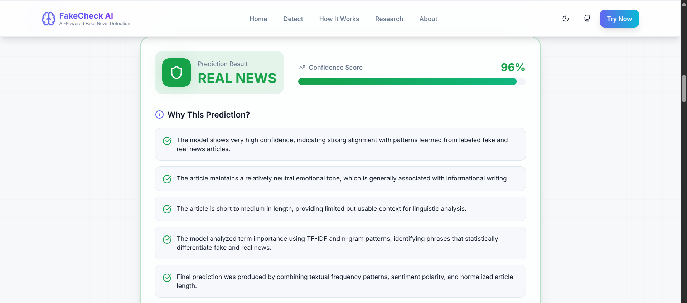
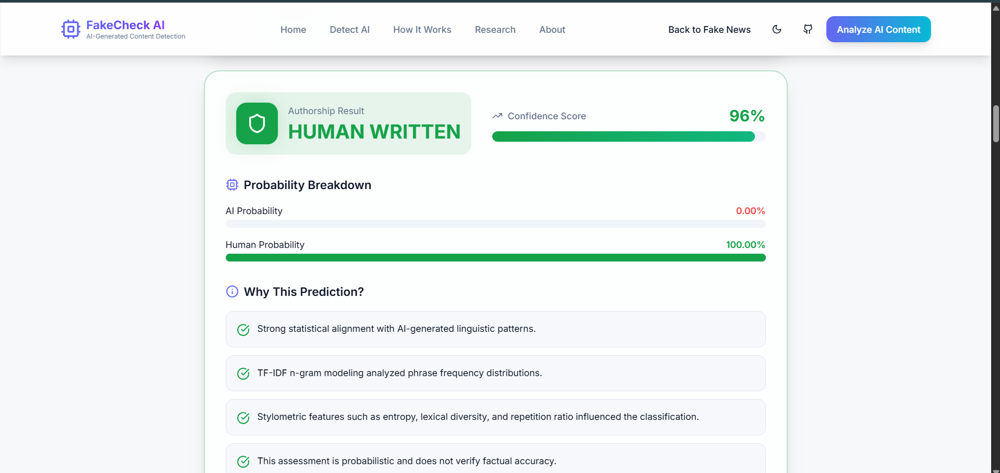

Frontend: https://fakecheckai.netlify.app/

Backend API: https://fake-checkai-8.onrender.com/

---

# 🧠 Core Modules

## 1️⃣ Fake News Detection Model

The Fake News Detection module classifies news articles as:

- 🟢 Real News
- 🔴 Fake News

### 🔍 How It Works

The model uses:

- TF-IDF Vectorization (n-grams)
- Text preprocessing
- Supervised machine learning classifiers

The model was trained on labeled fake/real news datasets and learns patterns such as:

- Sensational language
- Emotional bias
- Phrase frequency anomalies
- Clickbait structures
- Repetitive manipulation patterns

### 📊 Output Includes:

- Prediction (Fake / Real)
- Confidence Score
- Credibility Score
- Explanation reasons
- PDF downloadable report

---

## 2️⃣ AI Authorship Detection Model

This module determines whether content is:

- 🤖 AI Generated
- 👤 Human Written

### 🔍 Model Architecture

The AI detection model combines:

- TF-IDF vector features
- Stylometric feature extraction
- Feature scaling
- Supervised classifier

### ✨ Stylometric Features Used:

- Sentence burstiness
- Average sentence length
- Average word length
- Lexical diversity
- Stopword ratio
- Repetition score
- Shannon entropy
- Hapax legomena ratio
- Total word count
- Sentence count

These features help detect statistical smoothness often found in AI-generated text.

---

# 🏗 System Architecture

User
↓
Vercel (React Frontend)
↓
Render (Flask Backend)
↓
Machine Learning Models

Frontend → React (Vite + TypeScript)  
Backend → Flask + Scikit-learn  
Deployment → Vercel (Frontend) + Render (Backend)

---

# ✨ Features

### Fake News Detection
- Full article classification
- Confidence calibration
- Explanation generation
- PDF report export
- Real-time API-based checking

### AI Authorship Detection
- Full text analysis
- Sentence-level highlighting
- Sliding window detection
- Adjustable classification threshold
- Confidence smoothing
- Stylometric dashboard logic

### File Support
- TXT file upload
- PDF upload with extraction

---

# 🛠 Tech Stack

## Frontend
- React (Vite)
- TypeScript
- TailwindCSS
- Lucide Icons

## Backend
- Flask
- Scikit-learn
- Joblib
- NLTK
- NumPy
- SciPy
- Flask-CORS
- Gunicorn

---

# 📂 Project Structure

FakeCheckAI/
│
├── backend/
│ ├── app.py
│ ├── fake_news_model.pkl
│ ├── ai_detector_realistic.pkl
│ ├── requirements.txt
│
├── frontend/
│ ├── src/
│ ├── package.json
│ ├── vite.config.ts
│
└── README.md

---

# ⚙️ Local Setup

## 1️⃣ Clone Repository

git clone https://github.com/yourusername/fakecheckai.git
cd fakecheckai

---

## 2️⃣ Backend Setup

cd backend
pip install -r requirements.txt
python app.py

Backend runs at:
http://127.0.0.1:5000

---

## 3️⃣ Frontend Setup

cd frontend
npm install
npm run dev

Frontend runs at:
http://localhost:5173

---

# 🌍 Deployment Guide

## Backend (Render)

- Root Directory → backend
- Build Command → pip install -r requirements.txt
- Start Command → gunicorn app:app

Enable CORS inside Flask.

---

## Frontend (Vercel)

Set Environment Variable:

VITE_API_BASE_URL=https://your-backend-url.onrender.com

Deploy.

---

# 📊 Model Limitations

- TF-IDF models may struggle against highly refined modern LLM outputs.
- Short inputs reduce detection reliability.
- Results are probabilistic and not fact-verification systems.

---

# 🔮 Future Improvements

- Transformer-based detection (DistilBERT / RoBERTa)
- Perplexity-based AI scoring
- Model ensemble approach
- Explainable AI using SHAP
- User accounts and history tracking
- Real-time streaming detection

---

# 👨‍💻 Author

Vaibhav  
B.Tech Computer Science Student  

---

# 📜 License

This project is for educational and research purposes.
